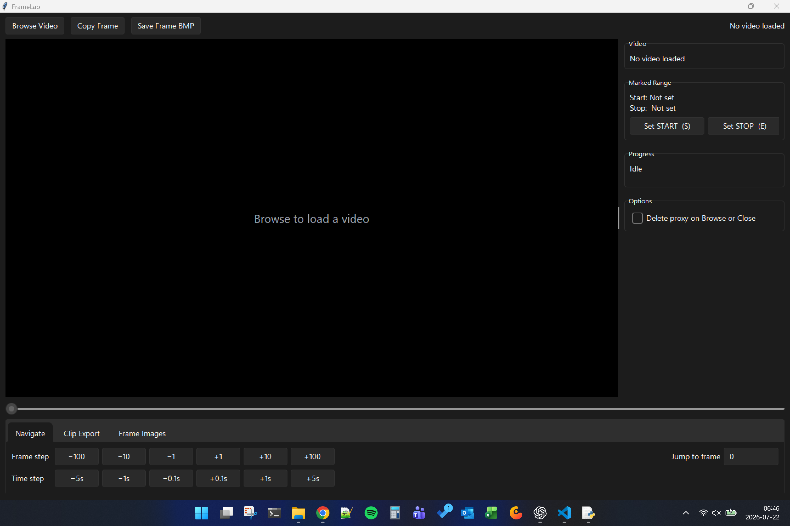
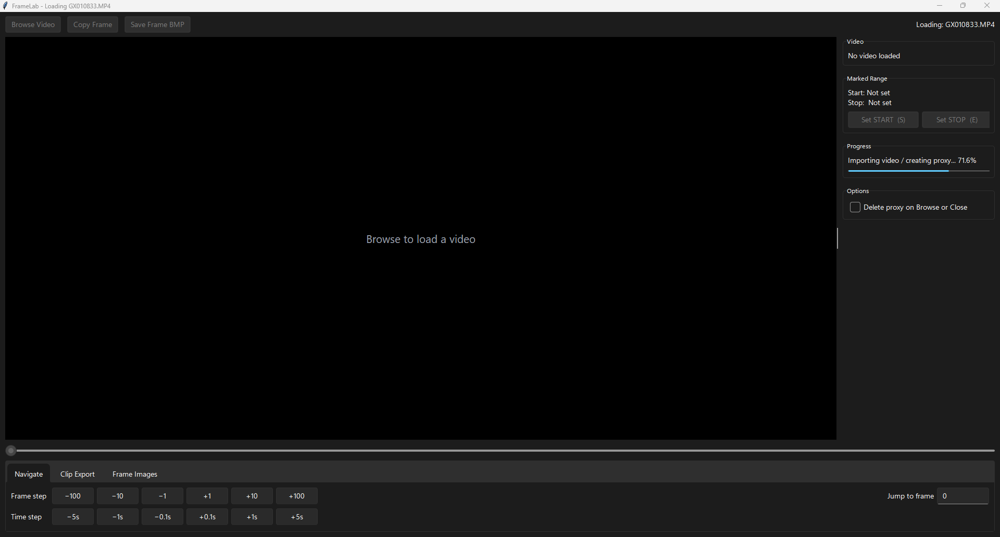
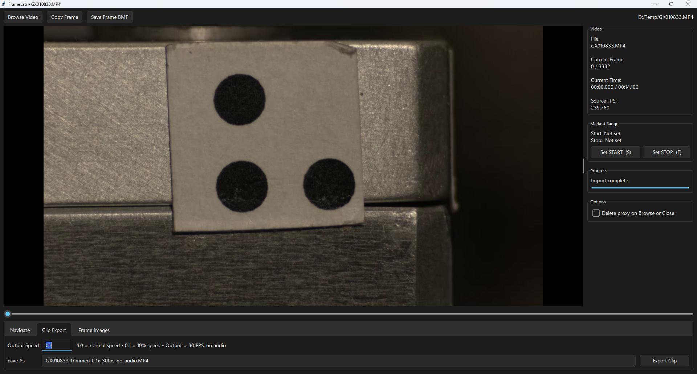
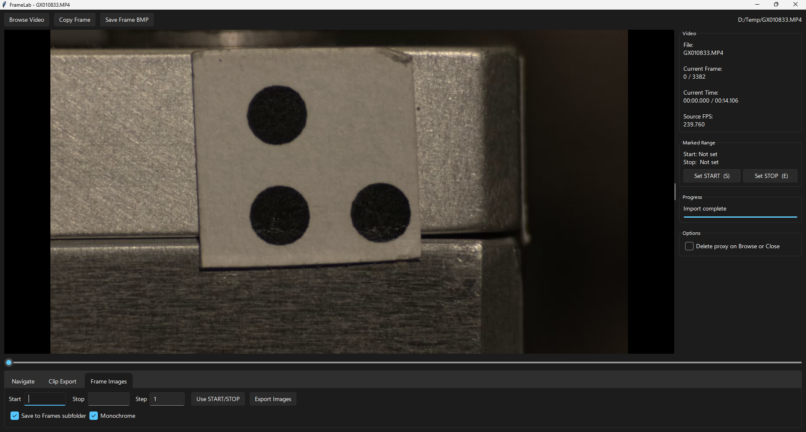
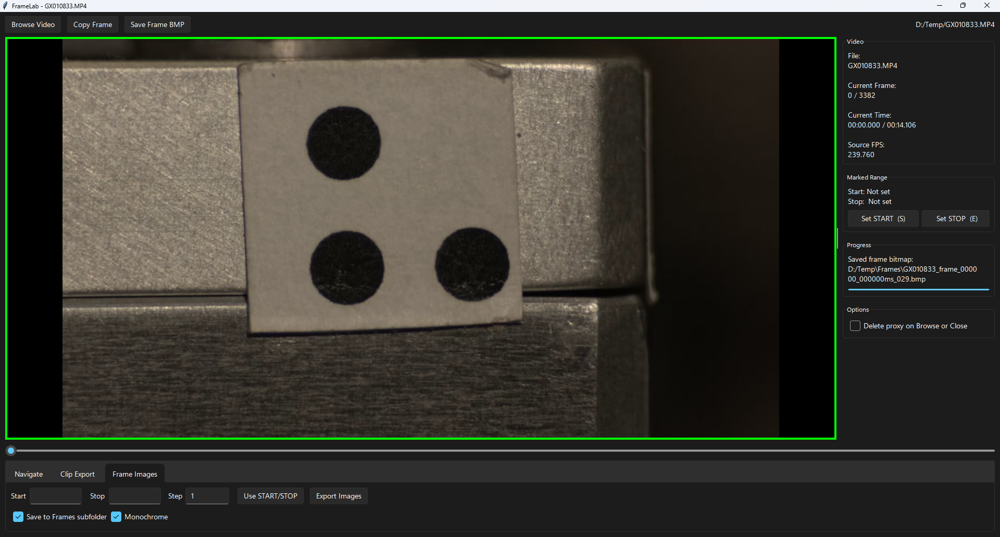
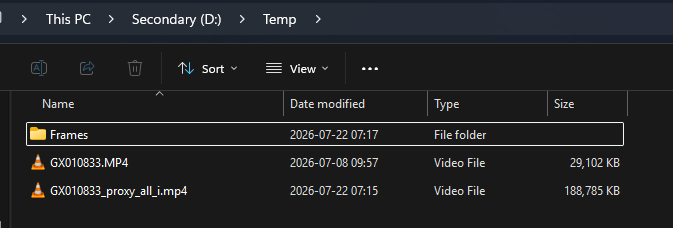
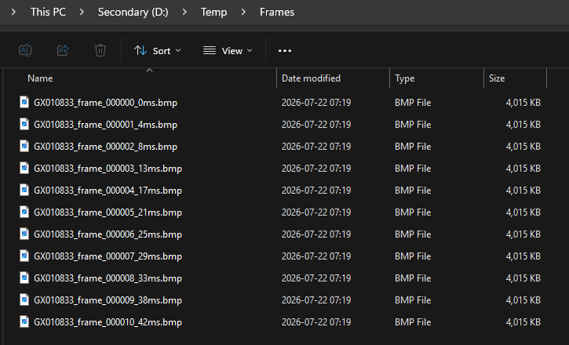

# FrameLab

FrameLab is a Windows application for frame-accurate video navigation, trimming, and image extraction. It is designed for machine vision and industrial automation workflows where precise frame selection and repeatable exports are important.

## Features

* Frame-by-frame video navigation
* Trim and export video clips
* Export individual frames or frame ranges
* Optional monochrome image export
* Copy the current frame directly to the clipboard
* Modern, responsive user interface

## Installation

Download the latest release from the project's [Releases](https://github.com/foxrid3r/FrameLab/releases) page and extract the ZIP file.

Run:

```text
FrameLab.exe
```

No Python installation is required.

FrameLab requires a separate [FFmpeg](https://ffmpeg.org/download.html)
installation that includes the `libx264` encoder. Add FFmpeg's `bin` directory
to the Windows `PATH`, then restart FrameLab. Verify the installation with:

```powershell
ffmpeg -version
ffmpeg -hide_banner -encoders | Select-String libx264
```

## System Requirements

* Windows 10 or Windows 11
* 64-bit operating system
* FFmpeg with `libx264`, available on `PATH`

## Documentation

### Quick Start

1. Select **Browse Video** and choose a video. FrameLab creates a seek-friendly proxy beside the source file; the progress panel reports when the import is complete.
2. Use the timeline, frame-step buttons, time-step buttons, or **Jump to frame** to find an exact frame.
3. Select **Set START (S)** and **Set STOP (E)** to mark a range for clip or image export.
4. Copy or save the current frame from the toolbar, or use the export tabs for a marked range.



*The initial workspace provides navigation controls and keeps export actions disabled until a video is loaded.*



*During import, the progress panel shows proxy creation status and the editing controls remain unavailable.*

### Navigate and Mark a Range

Once a video is loaded, the sidebar shows its filename, current frame and time, total duration, and source frame rate. The **Navigate** tab supports precise movement by frames or time. Mark the current position with **Set START (S)** and **Set STOP (E)**; the same range can be reused by both export tabs.


*The loaded-video workspace combines a large frame preview, exact position metadata, range markers, and navigation controls.*

The generated all-intra-frame proxy improves seeking accuracy. Enable **Delete proxy on Browse or Close** if you do not want to retain it after switching videos or exiting FrameLab.

### Export a Clip

Open **Clip Export**, choose an output speed, review the generated filename, and select **Export Clip**. A speed of `1.0` is normal speed; lower values create slow-motion output. Exported clips use 30 FPS and contain no audio.



*The Clip Export tab applies the marked range and lets you set playback speed and the destination filename.*

### Export Frame Images

Open **Frame Images** and enter the first frame, last frame, and step interval. **Use START/STOP** fills the range from the current markers. Enable **Save to Frames subfolder** to keep images together, and enable **Monochrome** for grayscale BMP output.



*The Frame Images tab exports every selected frame or a sampled sequence using the chosen step interval.*

The toolbar's **Copy Frame** command places the current frame on the clipboard, while **Save Frame BMP** writes it directly to disk. A green border and a message in the progress panel confirm a successful save.



*A green preview border and the saved path provide immediate confirmation that the frame was written.*

### Generated Files

By default, FrameLab keeps its generated proxy beside the source video and can place exported bitmaps in a `Frames` subfolder.



*A typical source folder contains the original video, its seek-friendly proxy, and a dedicated frame-output folder.*



*Exported filenames include the source name, zero-padded frame number, and timestamp in milliseconds.*

---

# Development

## Requirements

* Python 3.11

## Create a Development Environment

```powershell
py -3.11 -m venv .venv
.\.venv\Scripts\Activate.ps1

python -m pip install -e .
python -m pip install pyinstaller
```

Run from source:

```powershell
python -m framelab
```

## Build

Create a standalone executable:

```powershell
.\build.ps1
```

The build collects licenses and version information from the exact environment
under `dist\FrameLab\licenses`. FFmpeg is not included in the release. See
[Third-Party Notices](THIRD-PARTY-NOTICES.md) for release compliance details.

The packaged application will be generated in:

```text
dist\FrameLab\
```

Run the packaged version:

```powershell
.\dist\FrameLab\FrameLab.exe
```

## Project Structure

```text
FrameLab/
├── src/
├── pyproject.toml
├── FrameLab.spec
├── README.md
├── .venv/      (generated)
├── build/      (generated)
└── dist/       (generated)
```

The `.venv`, `build`, and `dist` directories are generated automatically and should not be committed to Git.

## Technologies

* Python 3.11
* Tkinter
* OpenCV
* Pillow
* NumPy
* sv_ttk
* PyInstaller
