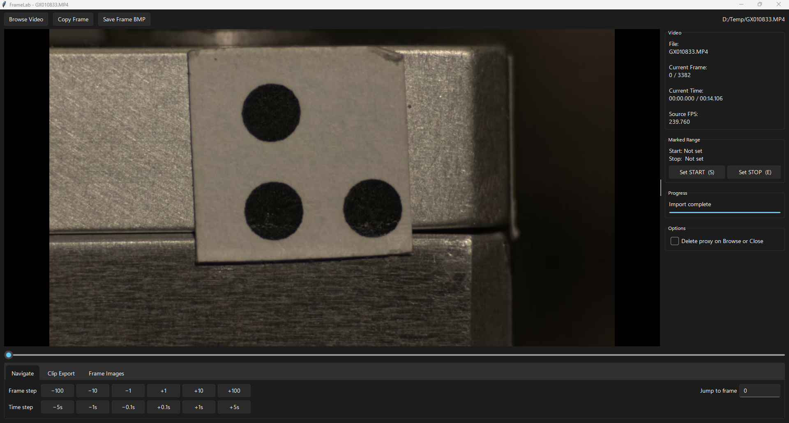

# FrameLab

FrameLab is a Windows desktop application for frame-accurate video navigation,
trimming, and image extraction. It is designed for machine-vision and
industrial-automation workflows where precise frame selection matters.

[**Download FrameLab for Windows**](https://github.com/foxrid3r/FrameLab/releases/latest)

## Quick start

1. Download the latest Windows ZIP from the [Releases page](https://github.com/foxrid3r/FrameLab/releases/latest).
2. Extract the ZIP and run `FrameLab.exe`.
3. Open a video, navigate to an exact frame, and mark a range for export.

No Python or separate FFmpeg installation is required.

## What it does

- Navigate video frame by frame or by precise time intervals.
- Mark reusable start and stop positions.
- Export trimmed clips at normal or slow-motion speed.
- Save individual frames or frame sequences as bitmap images.
- Copy the current frame directly to the clipboard.
- Create seek-friendly proxies for accurate navigation.

See the [user guide](docs/USER-GUIDE.md) for screenshots and complete usage
instructions.

## Requirements

- Windows 10 or Windows 11
- 64-bit operating system

## Development

Instructions for setting up a development environment, producing reproducible
releases, and rebuilding the bundled FFmpeg executable are in
[Building FrameLab](docs/BUILDING.md).

## License

FrameLab is free software licensed under the GNU General Public License,
version 3. Bundled components retain their respective licenses; see
[Third-Party Notices](THIRD-PARTY-NOTICES.md).
