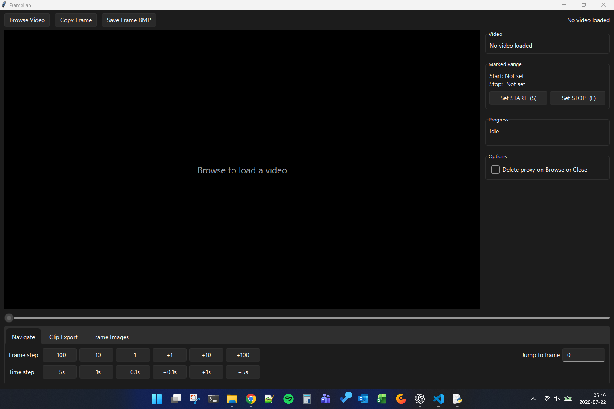
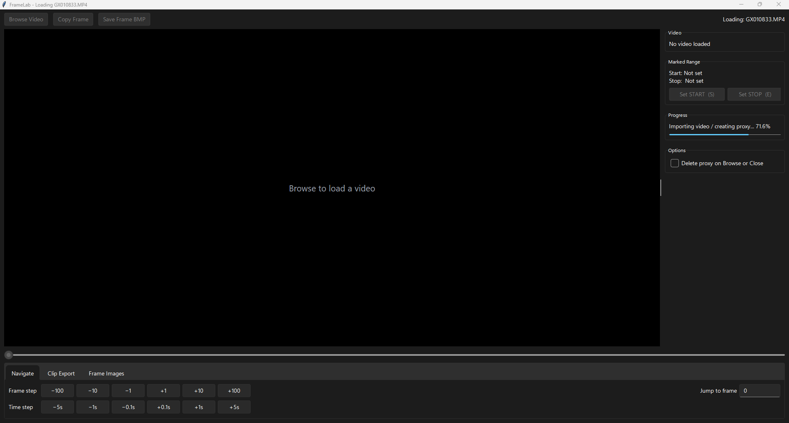
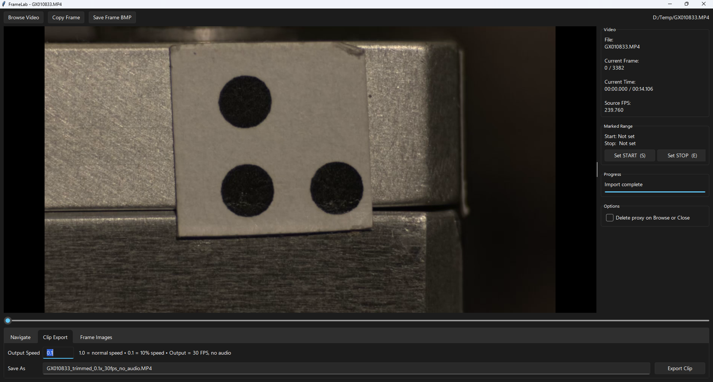
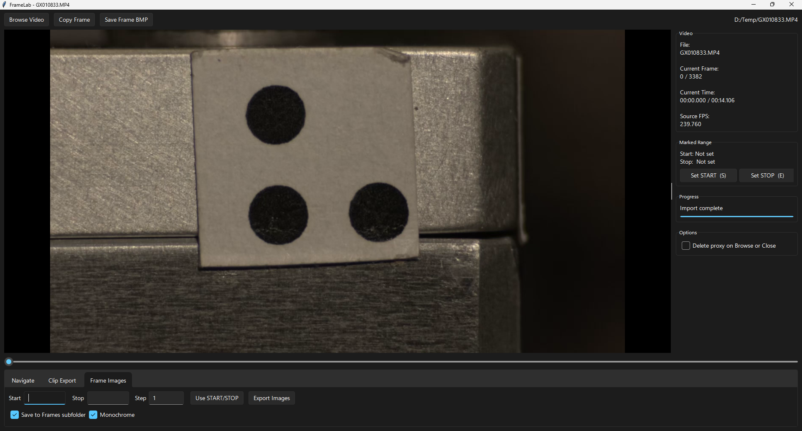
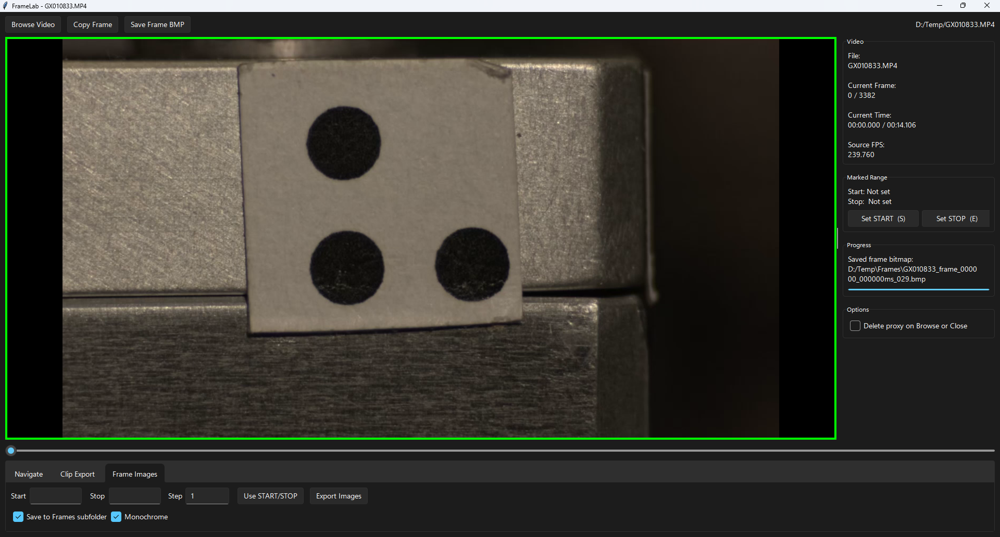
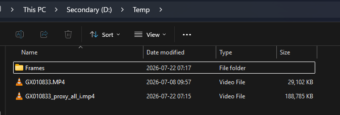
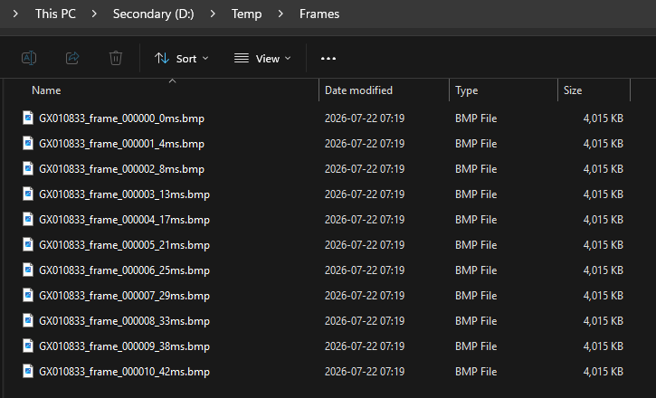

# FrameLab user guide

## Open a video

Select **Browse Video** and choose a video. FrameLab creates a seek-friendly
proxy beside the source file. The progress panel reports when import is
complete, and editing controls remain unavailable while the proxy is built.

## Navigate and mark a range

The sidebar shows the filename, current frame and time, total duration, and
source frame rate. Use the timeline, frame-step buttons, time-step buttons, or
**Jump to frame** to select an exact frame.

Select **Set START (S)** and **Set STOP (E)** to mark a range. Both export tabs
can reuse the same range.

Enable **Delete proxy on Browse or Close** if you do not want to retain the
generated proxy after switching videos or closing FrameLab.

## Add flags

Open **Flags**, enter a description, and select **Add Flag (F)** to flag the
current frame. Press **F** when focus is outside a text field, or **Enter**
in the description field. Select a flag to jump to its frame. **Copy** copies
the table for pasting into Excel, and **Delete** removes selected flags.
Use **Import…** and **Export…** to load or save timestamp files.

The bottom pane initially fits the Flags controls. Drag the divider above
the timeline to adjust its height.

## Export a clip

Open **Clip Export**, select an output speed, review the generated filename,
and select **Export Clip**. A speed of `1.0` is normal speed; lower values
create slow-motion output. Exported clips use 30 FPS and contain no audio.

## Export frame images

Open **Frame Images** and enter the first frame, last frame, and step interval.
**Use START/STOP** fills the range from the current markers. Enable **Save to
subfolder** to group the images, or **Monochrome** for grayscale BMP
output. Set **Basename** to choose the filename prefix; it defaults to the video
filename without its extension whenever a video is opened. A blank basename
uses the video name. With **Save to subfolder** enabled, edit the adjacent
field to choose a subfolder name (default: `Frames`). These settings apply to
both **Export Images** and **Save Frame BMP**.

The toolbar's **Copy Frame** command places the current frame on the clipboard.
**Save Frame BMP** writes it directly to disk. A green preview border and a
message in the progress panel confirm a successful save.

## Generated files

By default, FrameLab keeps its proxy beside the source video and can place
exported bitmaps in a `Frames` subfolder.

Exported filenames include the source name, zero-padded frame number, and
timestamp in milliseconds.

[Return to the project overview](../README.md)
